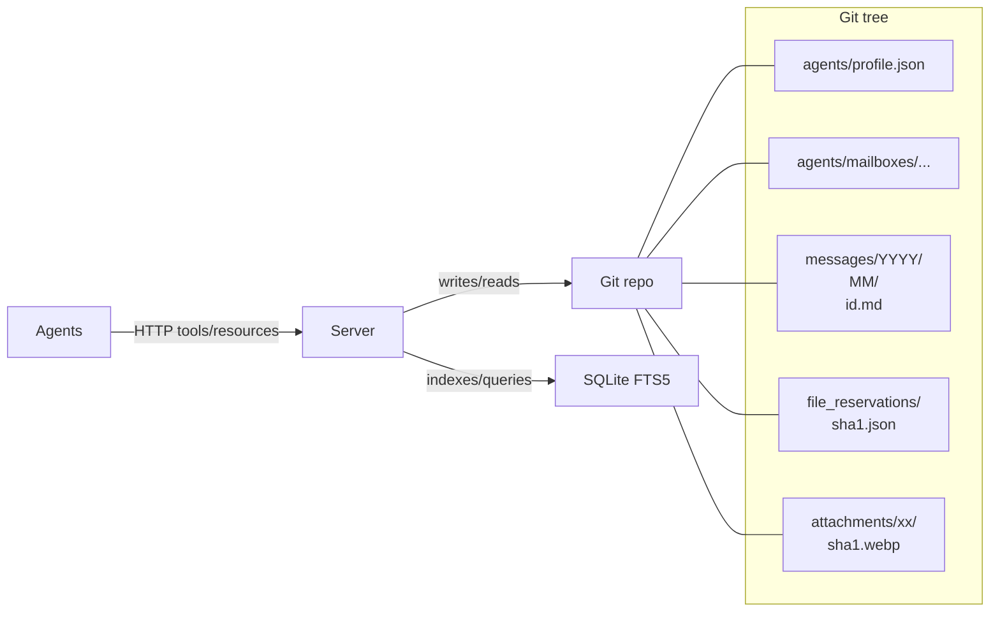
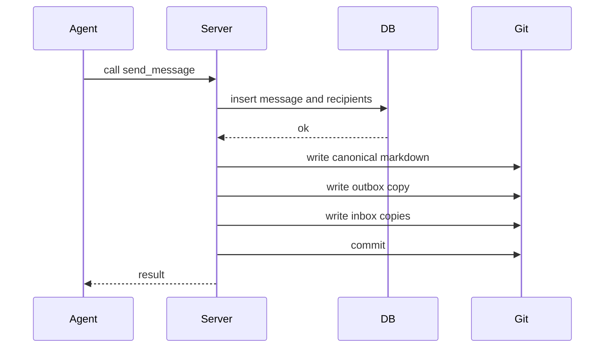
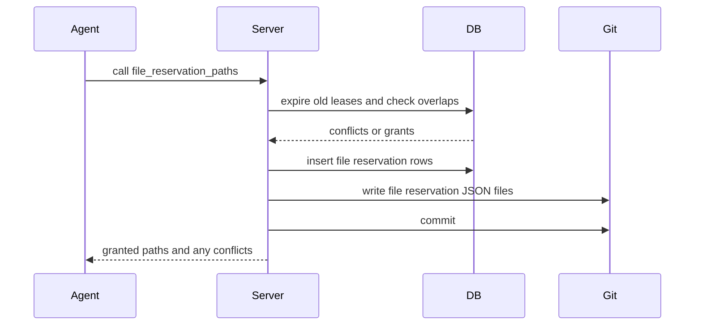
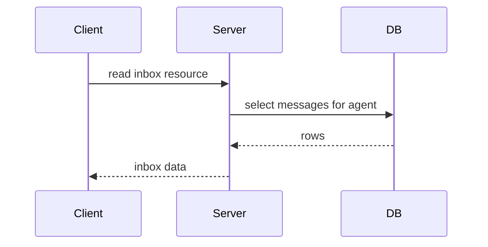

# MCP Agent Mail


> "It's like gmail for your coding agents!"

A mail-like coordination layer for coding agents, exposed as an HTTP-only FastMCP server. It gives agents memorable identities, an inbox/outbox, searchable message history, and voluntary file reservation "leases" to avoid stepping on each other.

Think of it as asynchronous email + directory + change-intent signaling for your agents, backed by Git (for human-auditable artifacts) and SQLite (for indexing and queries).

Status: Under active development. The design is captured in detail in `project_idea_and_guide.md` (start with the original prompt at the top of that file).

構成更新メモ（reports/plans）:
- レポート類は `reports/work`, `reports/audit`, `reports/test` に集約しました。
- 計画ファイルは `plans/`（例: `plans/diff-plan.json`）へ移動しました。
- ルート直下の報告ファイルは整理し、`reports/*` 配下へ移しています。

## Why this exists

Modern projects often run multiple coding agents at once (backend, frontend, scripts, infra). Without a shared coordination fabric, agents:

- Overwrite each other's edits or panic on unexpected diffs
- Miss critical context from parallel workstreams
- Require humans to "liaison" messages across tools and teams

This project provides a lightweight, interoperable layer so agents can:

- Register a temporary-but-persistent identity (e.g., GreenCastle)
- Send/receive GitHub-Flavored Markdown messages with images
- Search, summarize, and thread conversations
- Declare advisory file reservations (leases) on files/globs to signal intent
- Inspect a directory of active agents, programs/models, and activity

It's designed for: FastMCP clients and CLI tools (Claude Code, Codex, Gemini CLI, etc.) coordinating across one or more codebases.

## TLDR Quickstart

### One-line installer

```bash
curl -fsSL https://raw.githubusercontent.com/Dicklesworthstone/mcp_agent_mail/main/scripts/install.sh | bash -s -- --yes
```

What this does:

- Installs uv if missing and updates your PATH for this session
- Creates a Python 3.14 virtual environment and installs dependencies with uv
- Runs the auto-detect integration to wire up supported agent tools
- Starts the MCP HTTP server on port 8765 and prints a masked bearer token
- Creates helper scripts under `scripts/` (including `run_server_with_token.sh`)

Prefer a specific location or options? Add flags like `--dir <path>`, `--project-dir <path>`, `--no-start`, `--start-only`, or `--token <hex>`.

### If you want to do it yourself

Clone the repo, set up and install with uv in a python 3.14 venv (install uv if you don't have it already), and then run `scripts/automatically_detect_all_installed_coding_agents_and_install_mcp_agent_mail_in_all.sh`. This will automatically set things up for your various installed coding agent tools and start the MCP server on port 8765. If you want to run the MCP server again in the future, simply run `scripts/run_server_with_token.sh`:

```bash
# Install uv (if you don't have it already)
curl -LsSf https://astral.sh/uv/install.sh | sh
export PATH="$HOME/.local/bin:$PATH"

# Clone the repo
git clone https://github.com/Dicklesworthstone/mcp_agent_mail
cd mcp_agent_mail

# Create a Python 3.14 virtual environment and install dependencies
uv python install 3.14
uv venv -p 3.14
source .venv/bin/activate
uv sync

# Detect installed coding agents, integrate, and start the MCP server on port 8765
scripts/automatically_detect_all_installed_coding_agents_and_install_mcp_agent_mail_in_all.sh

# Later, to run the MCP server again with the same token
scripts/run_server_with_token.sh

# Now, simply launch Codex-CLI or Claude Code or other agent tools in other consoles; they should have the mail tool available. See below for a ready-made chunk of text you can add to the end of your existing AGENTS.md or CLAUDE.md files to help your agents better utilize the new tools.
```

## Ready-Made Blurb to Add to Your AGENTS.md or CLAUDE.md Files:
```
## MCP Agent Mail — coordination for multi-agent workflows

What it is
- A mail-like layer that lets coding agents coordinate asynchronously via MCP tools and resources.
- Provides identities, inbox/outbox, searchable threads, and advisory file reservations, with human-auditable artifacts in Git.

Why it's useful
- Prevents agents from stepping on each other with explicit file reservations (leases) for files/globs.
- Keeps communication out of your token budget by storing messages in a per-project archive.
- Offers quick reads (`resource://inbox/...`, `resource://thread/...`) and macros that bundle common flows.

How to use effectively
1) Same repository
   - Register an identity: call `ensure_project`, then `register_agent` using this repo's absolute path as `project_key`.
   - Reserve files before you edit: `file_reservation_paths(project_key, agent_name, ["src/**"], ttl_seconds=3600, exclusive=true)` to signal intent and avoid conflict.
   - Communicate with threads: use `send_message(..., thread_id="FEAT-123")`; check inbox with `fetch_inbox` and acknowledge with `acknowledge_message`.
   - Read fast: `resource://inbox/{Agent}?project=<abs-path>&limit=20` or `resource://thread/{id}?project=<abs-path>&include_bodies=true`.
   - Tip: set `AGENT_NAME` in your environment so the pre-commit guard can block commits that conflict with others' active exclusive file reservations.

2) Across different repos in one project (e.g., Next.js frontend + FastAPI backend)
   - Option A (single project bus): register both sides under the same `project_key` (shared key/path). Keep reservation patterns specific (e.g., `frontend/**` vs `backend/**`).
   - Option B (separate projects): each repo has its own `project_key`; use `macro_contact_handshake` or `request_contact`/`respond_contact` to link agents, then message directly. Keep a shared `thread_id` (e.g., ticket key) across repos for clean summaries/audits.

Macros vs granular tools
- Prefer macros when you want speed or are on a smaller model: `macro_start_session`, `macro_prepare_thread`, `macro_file_reservation_cycle`, `macro_contact_handshake`.
- Use granular tools when you need control: `register_agent`, `file_reservation_paths`, `send_message`, `fetch_inbox`, `acknowledge_message`.

Common pitfalls
- "from_agent not registered": always `register_agent` in the correct `project_key` first.
- "FILE_RESERVATION_CONFLICT": adjust patterns, wait for expiry, or use a non-exclusive reservation when appropriate.
- Auth errors: if JWT+JWKS is enabled, include a bearer token with a `kid` that matches server JWKS; static bearer is used only when JWT is disabled.
```

## Integrating with Beads (dependency‑aware task planning)

Beads is a lightweight task planner (`bd` CLI) that complements Agent Mail by keeping status and dependencies in one place while Mail handles messaging, file reservations, and audit trails. Project: [steveyegge/beads](https://github.com/steveyegge/beads)

Highlights:
- Beads owns task prioritization; Agent Mail carries the conversations and artifacts.
- Shared identifiers (e.g., `bd-123`) keep Beads issues, Mail threads, and commits aligned.
- Install the `bd` CLI via prebuilt release or Go build; see the repository for platform specifics.

Copy/paste blurb for agent-facing docs (leave as-is for reuse):

```

## Integrating with Beads (dependency‑aware task planning)

Beads provides a lightweight, dependency‑aware issue database and a CLI (`bd`) for selecting "ready work," setting priorities, and tracking status. It complements MCP Agent Mail's messaging, audit trail, and file‑reservation signals. Project: [steveyegge/beads](https://github.com/steveyegge/beads)

Recommended conventions
- **Single source of truth**: Use **Beads** for task status/priority/dependencies; use **Agent Mail** for conversation, decisions, and attachments (audit).
- **Shared identifiers**: Use the Beads issue id (e.g., `bd-123`) as the Mail `thread_id` and prefix message subjects with `[bd-123]`.
- **Reservations**: When starting a `bd-###` task, call `file_reservation_paths(...)` for the affected paths; include the issue id in the `reason` and release on completion.

Typical flow (agents)
1) **Pick ready work** (Beads)
   - `bd ready --json` → choose one item (highest priority, no blockers)
2) **Reserve edit surface** (Mail)
   - `file_reservation_paths(project_key, agent_name, ["src/**"], ttl_seconds=3600, exclusive=true, reason="bd-123")`
3) **Announce start** (Mail)
   - `send_message(..., thread_id="bd-123", subject="[bd-123] Start: <short title>", ack_required=true)`
4) **Work and update**
   - Reply in‑thread with progress and attach artifacts/images; keep the discussion in one thread per issue id
5) **Complete and release**
   - `bd close bd-123 --reason "Completed"` (Beads is status authority)
   - `release_file_reservations(project_key, agent_name, paths=["src/**"])`
   - Final Mail reply: `[bd-123] Completed` with summary and links

Mapping cheat‑sheet
- **Mail `thread_id`** ↔ `bd-###`
- **Mail subject**: `[bd-###] …`
- **File reservation `reason`**: `bd-###`
- **Commit messages (optional)**: include `bd-###` for traceability

Event mirroring (optional automation)
- On `bd update --status blocked`, send a high‑importance Mail message in thread `bd-###` describing the blocker.
- On Mail "ACK overdue" for a critical decision, add a Beads label (e.g., `needs-ack`) or bump priority to surface it in `bd ready`.

Pitfalls to avoid
- Don't create or manage tasks in Mail; treat Beads as the single task queue.
- Always include `bd-###` in message `thread_id` to avoid ID drift across tools.

```

## Core ideas (at a glance)

- HTTP-only FastMCP server (Streamable HTTP). No SSE, no STDIO.
- Dual persistence model:
  - Human-readable markdown in a per-project Git repo for every canonical message and per-recipient inbox/outbox copy
  - SQLite with FTS5 for fast search, directory queries, and file reservations/leases
- "Directory/LDAP" style queries for agents; memorable adjective+noun names
- Advisory file reservations for editing surfaces; optional pre-commit guard
- Resource layer for convenient reads (e.g., `resource://inbox/{agent}`)

## Typical use cases

- Multiple agents splitting a large refactor across services while staying in sync
- Frontend and backend teams of agents coordinating thread-by-thread
- Protecting critical migrations with exclusive file reservations and a pre-commit guard
- Searching and summarizing long technical discussions as threads evolve
- Discovering and linking related projects (e.g., frontend/backend) through AI-powered suggestions

## Architecture



## Web UI (human-facing mail viewer)

The server ships a lightweight, server‑rendered Web UI for humans. It lets you browse projects, agents, inboxes, single messages, attachments, file reservations, and perform full‑text search with FTS5 when available (with an automatic LIKE fallback).

- Where it lives: built into the HTTP server in `mcp_agent_mail.http` under the `/mail` path.
- Who it's for: humans reviewing activity; agents should continue to use the MCP tools/resources API.

### Launching the Web UI

Recommended (simple):

```bash
scripts/run_server_with_token.sh
# then open http://127.0.0.1:8765/mail
```

Advanced (manual commands):

```bash
uv run python -m mcp_agent_mail.http --host 127.0.0.1 --port 8765
# or:
uv run uvicorn mcp_agent_mail.http:build_http_app --factory --host 127.0.0.1 --port 8765
```

Auth notes:
- GET pages in the UI are not gated by the RBAC middleware (it classifies POSTed MCP calls only), but if you set a bearer token the separate BearerAuth middleware protects all routes by default.
- For local dev, set `HTTP_ALLOW_LOCALHOST_UNAUTHENTICATED=true` (and optionally `HTTP_BEARER_TOKEN`), so localhost can load the UI without headers.
- Health endpoints are always open at `/health/*`.

### Routes and what you can do

- `/mail` (Unified inbox + Projects + Related Projects Discovery)
  - Shows a unified, reverse‑chronological inbox of recent messages across all projects with excerpts, relative timestamps, sender/recipients, and project badges.
  - Below the inbox, lists all projects (slug, human name, created time) with sibling suggestions.
  - Suggests **likely sibling projects** when two slugs appear to be parts of the same product (e.g., backend vs. frontend). Suggestions are ranked with heuristics and, when `LLM_ENABLED=true`, an LLM pass across key docs (`README.md`, `AGENTS.md`, etc.).
  - Humans can **Confirm Link** or **Dismiss** suggestions from the dashboard. Confirmed siblings become highlighted badges but *do not* automatically authorize cross‑project messaging—agents must still establish `AgentLink` approvals via `request_contact`/`respond_contact`.

- `/mail/projects` (Projects index)
  - Dedicated projects list view; click a project to drill in.

- `/mail/{project}` (Project overview + search + agents)
  - Rich search form with filters:
    - Scope: subject/body/both, Order: relevance or time, optional "boost subject".
    - Query tokens: supports `subject:foo`, `body:"multi word"`, quoted phrases, and bare terms.
    - Uses FTS5 bm25 scoring when available; otherwise falls back to SQL LIKE on subject/body with your chosen scope.
  - Results show subject, sender, created time, thread id, and a highlighted snippet when using FTS.
  - Agents panel shows registered agents for the project with a link to each inbox.
  - Quick links to File Reservations and Attachments for the project header.

- `/mail/{project}/inbox/{agent}` (Inbox for one agent)
  - Reverse‑chronological list with subject, sender, created time, importance badge, thread id.
  - Pagination (`?page=N&limit=M`).

- `/mail/{project}/message/{id}` (Message detail)
  - Shows subject, sender, created time, importance, recipients (To/Cc/Bcc), thread messages.
  - Body rendering:
    - If the server pre‑converted markdown to HTML, it's sanitized with Bleach (limited tags/attributes, safe CSS via CSSSanitizer) and then displayed.
    - Otherwise markdown is rendered client‑side with Marked + Prism for code highlighting.
  - Attachments are referenced from the message frontmatter (WebP files or inline data URIs).

- `/mail/{project}/search?q=...` (Dedicated search page)
  - Same query syntax as the project overview search, with a token "pill" UI for assembling/removing filters.

- `/mail/{project}/file_reservations` (File Reservations list)
  - Displays active and historical file reservations (exclusive/shared, path pattern, timestamps, released/expired state).

- `/mail/{project}/attachments` (Messages with attachments)
  - Lists messages that contain any attachments, with subject and created time.
  
- `/mail/unified-inbox` (Cross-project activity)
  - Shows recent messages across all projects with thread counts and sender/recipients.

### Human Overseer: Sending Messages to Agents

Sometimes a human operator needs to guide or redirect agents directly—whether to handle an urgent issue, provide clarification, or adjust priorities. The **Human Overseer** feature provides a web-based message composer that lets humans send high-priority messages to any combination of agents in a project.

**Access:** Click the prominent **"Send Message"** button (with the Overseer badge) in the header of any project view (`/mail/{project}`), or navigate directly to `/mail/{project}/overseer/compose`.

#### What Makes Overseer Messages Special

1. **Automatic Preamble**: Every message includes a formatted preamble that clearly identifies it as coming from a human operator and instructs agents to:
   - **Pause current work** temporarily
   - **Prioritize the human's request** over existing tasks
   - **Resume original plans** afterward (unless modified by the instructions)

2. **High Priority**: All overseer messages are automatically marked as **high importance**, ensuring they stand out in agent inboxes.

3. **Policy Bypass**: Overseer messages bypass normal contact policies, so humans can always reach any agent regardless of their contact settings.

4. **Special Sender Identity**: Messages come from a special agent named **"HumanOverseer"** (automatically created per project) with:
   - Program: `WebUI`
   - Model: `Human`
   - Contact Policy: `open`

#### The Message Preamble

Every overseer message begins with this preamble (automatically prepended):

```
---

🚨 MESSAGE FROM HUMAN OVERSEER 🚨

This message is from a human operator overseeing this project. Please prioritize
the instructions below over your current tasks.

You should:
1. Temporarily pause your current work
2. Complete the request described below
3. Resume your original plans afterward (unless modified by these instructions)

The human's guidance supersedes all other priorities.

---

[Your message body follows here]
```

#### Using the Composer

The composer interface provides:

- **Recipient Selection**: Checkbox grid of all registered agents (with "Select All" / "Clear" shortcuts)
- **Subject Line**: Required, shown in agent inboxes
- **Message Body**: GitHub-flavored Markdown editor with preview
- **Thread ID** (optional): Continue an existing conversation or start a new one
- **Preamble Preview**: See exactly how your message will appear to agents

#### Example Use Cases

**Urgent Issue:**
```
Subject: Urgent: Stop migration and revert changes

The database migration in PR #453 is causing data corruption in staging.

Please:
1. Immediately stop any migration-related work
2. Revert commits from the last 2 hours
3. Wait for my review before resuming

I'm investigating the root cause now.
```

**Priority Adjustment:**
```
Subject: New Priority: Security Vulnerability

A critical security vulnerability was just disclosed in our auth library.

Drop your current tasks and:
1. Update `auth-lib` to version 2.4.1 immediately
2. Review all usages in src/auth/
3. Run the full security test suite
4. Report status in thread #892

This takes precedence over the refactoring work.
```

**Clarification:**
```
Subject: Clarification on API design approach

I see you're debating REST vs. GraphQL in thread #234.

Go with REST for now because:
- Our frontend team has more REST experience
- GraphQL adds complexity we don't need yet
- We can always add GraphQL later if needed

Resume the API implementation with REST.
```

#### How Agents See Overseer Messages

When agents check their inbox (via `fetch_inbox` or `resource://inbox/{name}`), overseer messages appear like any other message but with:

- **Sender**: `HumanOverseer`
- **Importance**: `high` (displayed prominently)
- **Body**: Starts with the overseer preamble, followed by the human's message
- **Visual cues**: In the Web UI, these messages may have special highlighting (future enhancement)

Agents can reply to overseer messages just like any other message, continuing the conversation thread.

#### Technical Details

- **Storage**: Overseer messages are stored identically to agent-to-agent messages (Git + SQLite)
- **Git History**: Fully auditable—message appears in `messages/YYYY/MM/{id}.md` with commit history
- **Thread Continuity**: Can be part of existing threads or start new ones
- **No Authentication Bypass**: The overseer compose form still requires proper HTTP server authentication (if enabled)

#### Design Philosophy

The Human Overseer feature is designed to be:

- **Explicit**: Agents clearly know when guidance comes from a human vs. another agent
- **Respectful**: Instructions acknowledge agents have existing work and shouldn't just "drop everything" permanently
- **Temporary**: Agents are told to resume original plans once the human's request is complete
- **Flexible**: Humans can override this guidance directly in their message body

This creates a clear hierarchy (human → agents) while maintaining the collaborative, respectful tone of the agent communication system.

### Related Projects Discovery

The Projects index (`/mail`) features an **AI-powered discovery system** that intelligently suggests which projects should be linked together—think frontend + backend, or related microservices.

#### How Discovery Works

**1. Smart Analysis**
The system uses multiple signals to identify relationships:
- **Pattern matching**: Compares project names and paths (e.g., "my-app-frontend" ↔ "my-app-backend")
- **AI understanding** (when `LLM_ENABLED=true`): Reads `README.md`, `AGENTS.md`, and other docs to understand each project's purpose and detect natural relationships
- **Confidence scoring**: Ranks suggestions from 0-100% with clear rationales

**2. Beautiful Suggestions**
Related projects appear as polished cards on your dashboard with:
- 🎯 Visual confidence indicators showing match strength
- 💬 AI-generated rationales explaining the relationship
- ✅ **Confirm Link** — accept the suggestion
- ✖️ **Dismiss** — hide irrelevant matches

**3. Quick Navigation**
Once confirmed, both projects display interactive badges for instant navigation between related codebases.

#### Why Suggestions, Not Auto-Linking?

> **TL;DR**: We keep you in control. Discovery helps you find relationships; explicit approvals control who can actually communicate.

**Agent Mail uses agent-centric messaging** — every message follows explicit permission chains:

```
Send Message → Find Recipient → Check AgentLink Approval → Deliver
```

This design ensures:
- **Security**: No accidental cross-project message delivery
- **Transparency**: You always know who can talk to whom
- **Audit trails**: All communication paths are explicitly approved

**Why not auto-link with AI?**
If we let an LLM automatically authorize messaging between projects, we'd be:
- ❌ Bypassing contact policies without human oversight
- ❌ Risking message misdelivery to unintended recipients
- ❌ Creating invisible routing paths that are hard to audit
- ❌ Potentially linking ambiguously-named projects incorrectly

Instead, we give you **discovery + control**:
- ✅ AI suggests likely relationships (safe, read-only analysis)
- ✅ You confirm what makes sense (one click)
- ✅ Agents still use `request_contact` / `respond_contact` for actual messaging permissions
- ✅ Clear separation: discovery ≠ authorization

#### The Complete Workflow

```
1. System suggests: "These projects look related" (AI analysis)
           ↓
2. You confirm: "Yes, link them" (updates UI badges)
           ↓
3. Agents request: request_contact(from_agent, to_agent, to_project)
           ↓
4. You approve: respond_contact(accept=true)
           ↓
5. Messages flow: Agents can now communicate across projects
```

**Think of it like LinkedIn**: The system suggests connections, but only *you* decide who gets to send messages.

### Search syntax (UI)

The UI shares the same parsing as the API's `_parse_fts_query`:
- Field filters: `subject:login`, `body:"api key"`
- Phrase search: `"build plan"`
- Combine terms: `login AND security` (FTS)
- Fallback LIKE: scope determines whether subject, body, or both are searched

### Prerequisites to see data

The UI reads from the same SQLite + Git artifacts as the MCP tools. To populate content:
1) Ensure a project exists (via tool call or CLI):
   - Ensure/create project: `ensure_project(human_key)`
2) Register one or more agents: `register_agent(project_key, program, model, name?)`
3) Send messages: `send_message(...)` (attachments and inline images are supported; images may be converted to WebP).

Once messages exist, visit `/mail`, click your project, then open an agent inbox or search.

### Implementation and dependencies

- Templates live in `src/mcp_agent_mail/templates/` and are rendered by Jinja2.
- Markdown is converted with `markdown2` on the server where possible; HTML is sanitized with Bleach (with CSS sanitizer when available).
- Tailwind CSS, Lucide icons, Alpine.js, Marked, and Prism are loaded via CDN in `base.html` for a modern look without a frontend build step.
- All rendering is server‑side; there's no SPA router. Pages degrade cleanly without JavaScript.

### Security considerations

- HTML sanitization: Only a conservative set of tags/attributes are allowed; CSS is filtered. Links are limited to http/https/mailto/data.
- Auth: Use bearer token or JWT when exposing beyond localhost. For local dev, enable localhost bypass as noted above.
- Rate limiting (optional): Token‑bucket limiter can be enabled; UI GET requests are light and unaffected by POST limits.

### Troubleshooting the UI

- Blank page or 401 on localhost: Either unset `HTTP_BEARER_TOKEN` or set `HTTP_ALLOW_LOCALHOST_UNAUTHENTICATED=true`.
- No projects listed: Create one with `ensure_project`.
- Empty inbox: Verify recipient names match exactly and messages were sent to that agent.
- Search returns nothing: Try simpler terms or the LIKE fallback (toggle scope/body).


### On-disk layout (per project)

```
<store>/projects/<slug>/
  agents/<AgentName>/profile.json
  agents/<AgentName>/inbox/YYYY/MM/<msg-id>.md
  agents/<AgentName>/outbox/YYYY/MM/<msg-id>.md
  messages/YYYY/MM/<msg-id>.md
  messages/threads/<thread-id>.md  # optional human digest maintained by the server
  file_reservations/<sha1-of-path>.json
  attachments/<xx>/<sha1>.webp
```

### Message file format

Messages are GitHub-Flavored Markdown with JSON frontmatter (fenced by `---json`). Attachments are either WebP files referenced by relative path or inline base64 WebP data URIs.

```markdown
---json
{
  "id": 1234,
  "thread_id": "TKT-123",
  "project": "/abs/path/backend",
  "project_slug": "backend-abc123",
  "from": "GreenCastle",
  "to": ["BlueLake"],
  "cc": [],
  "created": "2025-10-23T15:22:14Z",
  "importance": "high",
  "ack_required": true,
  "attachments": [
    {"type": "file", "media_type": "image/webp", "path": "projects/backend-abc123/attachments/2a/2a6f.../diagram.webp"}
  ]
}
---

# Build plan for /api/users routes

... body markdown ...
```

### Data model (SQLite)

- `projects(id, human_key, slug, created_at)`
- `agents(id, project_id, name, program, model, task_description, inception_ts, last_active_ts, attachments_policy, contact_policy)`
- `messages(id, project_id, sender_id, thread_id, subject, body_md, created_ts, importance, ack_required, attachments)`
- `message_recipients(message_id, agent_id, kind, read_ts, ack_ts)`
- `file_reservations(id, project_id, agent_id, path_pattern, exclusive, reason, created_ts, expires_ts, released_ts)`
- `agent_links(id, a_project_id, a_agent_id, b_project_id, b_agent_id, status, reason, created_ts, updated_ts, expires_ts)`
- `project_sibling_suggestions(id, project_a_id, project_b_id, score, status, rationale, created_ts, evaluated_ts, confirmed_ts, dismissed_ts)`
- `fts_messages(message_id UNINDEXED, subject, body)` + triggers for incremental updates

### Concurrency and lifecycle

- One request/task = one isolated operation
- Archive writes are guarded by a per-project `.archive.lock` under `projects/<slug>/`
- Git index/commit operations are serialized across the shared archive repo by a repo-level `.commit.lock`
- DB operations are short-lived and scoped to each tool call; FTS triggers keep the search index current
- Artifacts are written first, then committed as a cohesive unit with a descriptive message
- Attachments are content-addressed (sha1) to avoid duplication

## How it works (key flows)

1) Create an identity

- `register_agent(project_key, program, model, name?, task_description?)` → creates/updates a named identity, persists profile to Git, and commits.

2) Send a message

- `send_message(project_key, sender_name, to[], subject, body_md, cc?, bcc?, attachment_paths?, convert_images?, importance?, ack_required?, thread_id?, auto_contact_if_blocked?)`
- Writes a canonical message under `messages/YYYY/MM/`, an outbox copy for the sender, and inbox copies for each recipient; commits all artifacts.
- Optionally converts images (local paths or data URIs) to WebP and embeds small ones inline.



3) Check inbox

- `fetch_inbox(project_key, agent_name, since_ts?, urgent_only?, include_bodies?, limit?)` returns recent messages, preserving thread_id where available.
- `acknowledge_message(project_key, agent_name, message_id)` marks acknowledgements.

4) Avoid conflicts with file reservations (leases)

- `file_reservation_paths(project_key, agent_name, paths[], ttl_seconds, exclusive, reason)` records an advisory lease in DB and writes JSON reservation artifacts in Git; conflicts are reported if overlapping active exclusives exist (reservations are still granted; conflicts are returned alongside grants).
- `release_file_reservations(project_key, agent_name, paths? | file_reservation_ids?)` releases active leases (all if none specified). JSON artifacts remain for audit history.
- Optional: install a pre-commit hook in your code repo that blocks commits conflicting with other agents' active exclusive file reservations.



5) Search & summarize

- `search_messages(project_key, query, limit?)` uses FTS5 over subject and body.
- `summarize_thread(project_key, thread_id, include_examples?)` extracts key points, actions, and participants from the thread.
- `reply_message(project_key, message_id, sender_name, body_md, ...)` creates a subject-prefixed reply, preserving or creating a thread.

### Semantics & invariants

- Identity
  - Names are memorable adjective+noun and unique per project; `name_hint` is sanitized (alnum) and used if available
  - `whois` returns the stored profile; `list_agents` can filter by recent activity
  - `last_active_ts` is bumped on relevant interactions (messages, inbox checks, etc.)
- Threads
  - Replies inherit `thread_id` from the original; if missing, the reply sets `thread_id` to the original message id
  - Subject lines are prefixed (e.g., `Re:`) for readability in mailboxes
- Attachments
  - Image references (file path or data URI) are converted to WebP; small images embed inline when policy allows
  - Non-absolute paths resolve relative to the project repo root
  - Stored under `attachments/<xx>/<sha1>.webp` and referenced by relative path in frontmatter
- File Reservations
  - TTL-based; exclusive means "please don't modify overlapping surfaces" for others until expiry or release
  - Conflict detection is per exact path pattern; shared reservations can coexist, exclusive conflicts are surfaced
  - JSON artifacts remain in Git for audit even after release (DB tracks release_ts)
- Search
  - External-content FTS virtual table and triggers index subject/body on insert/update/delete
  - Queries are constrained to the project id and ordered by `created_ts DESC`

## Contact model and "consent-lite" messaging

Goal: make coordination "just work" without spam across unrelated agents. The server enforces per-project isolation by default and adds an optional consent layer within a project so agents only contact relevant peers.

### Isolation by project

- All tools require a `project_key`. Agents only see messages addressed to them within that project.
- An agent working in Project A is invisible to agents in Project B unless explicit cross-project contact is established (see below). This avoids distraction between unrelated repositories.

### Policies (per agent)

- `open`: accept any targeted messages in the project.
- `auto` (default): allow messages when there is obvious shared context (e.g., same thread participants; recent overlapping active file reservations; recent prior direct contact within a TTL); otherwise requires a contact request.
- `contacts_only`: require an approved contact link first.
- `block_all`: reject all new contacts (errors with CONTACT_BLOCKED).

Use `set_contact_policy(project_key, agent_name, policy)` to update.

### Request/approve contact

- `request_contact(project_key, from_agent, to_agent, reason?, ttl_seconds?)` creates or refreshes a pending link and sends a small ack_required "intro" message to the recipient.
- `respond_contact(project_key, to_agent, from_agent, accept, ttl_seconds?)` approves or denies; approval grants messaging until expiry.
- `list_contacts(project_key, agent_name)` surfaces current links.

### Auto-allow heuristics (no explicit request required)

- Same thread: replies or messages to thread participants are allowed.
- Recent overlapping file reservations: if sender and recipient hold active file reservations in the project, messaging is allowed.
- Recent prior contact: a sliding TTL allows follow-ups between the same pair.

These heuristics minimize friction while preventing cold spam.

### Cross-project coordination (frontend vs backend repos)

When two repos represent the same underlying project (e.g., `frontend` and `backend`), you have two options:

1) Use the same `project_key` across both workspaces. Agents in both repos operate under one project namespace and benefit from full inbox/outbox coordination automatically.

2) Keep separate `project_key`s and establish explicit contact:
   - In `backend`, agent `GreenCastle` calls:
     - `request_contact(project_key="/abs/path/backend", from_agent="GreenCastle", to_agent="BlueLake", reason="API contract changes")`
   - In `frontend`, `BlueLake` calls:
     - `respond_contact(project_key="/abs/path/backend", to_agent="BlueLake", from_agent="GreenCastle", accept=true)`
   - After approval, messages can be exchanged; in default `auto` policy the server allows follow-up threads/reservation-based coordination without re-requesting.

Important: You can also create reciprocal links or set `open` policy for trusted pairs. The consent layer is on by default (CONTACT_ENFORCEMENT_ENABLED=true) but is designed to be non-blocking in obvious collaboration contexts.

<!-- Consolidated in API Quick Reference → Tools below to avoid duplication -->

## Resource layer (read-only URIs)

Expose common reads as resources that clients can fetch. See API Quick Reference → Resources for the full list and parameters.

Example (conceptual) resource read:

```json
{
  "method": "resources/read",
  "params": {"uri": "resource://inbox/BlueLake?project=/abs/path/backend&limit=20"}
}
```

<!-- Parameters consolidated in API Quick Reference → Resources -->



<!-- View URIs consolidated in API Quick Reference → Resources -->

## File Reservations and the optional pre-commit guard

Exclusive file reservations are advisory but visible and auditable:

- A reservation JSON is written to `file_reservations/<sha1(path)>.json` capturing holder, pattern, exclusivity, created/expires
- The pre-commit guard scans active exclusive reservations and blocks commits that touch conflicting paths held by another agent
- Agents must set `AGENT_NAME` so the guard knows who "owns" the commit

Install the guard into a code repo (conceptual tool call):

```json
{
  "method": "tools/call",
  "params": {
    "name": "install_precommit_guard",
    "arguments": {
      "project_key": "/abs/path/backend",
      "code_repo_path": "/abs/path/backend"
    }
  }
}
```

## Configuration

Configuration is loaded from an existing `.env` via `python-decouple`. Do not use `os.getenv` or auto-dotenv loaders.

```python
from decouple import Config as DecoupleConfig, RepositoryEnv

decouple_config = DecoupleConfig(RepositoryEnv(".env"))

STORAGE_ROOT = decouple_config("STORAGE_ROOT", default="~/.mcp_agent_mail_git_mailbox_repo")
HTTP_HOST = decouple_config("HTTP_HOST", default="127.0.0.1")
HTTP_PORT = int(decouple_config("HTTP_PORT", default=8765))
HTTP_PATH = decouple_config("HTTP_PATH", default="/mcp/")
```

Common variables you may set:

### Configuration reference

| Name | Default | Description |
| :-- | :-- | :-- |
| `STORAGE_ROOT` | `~/.mcp_agent_mail_git_mailbox_repo` | Root for per-project repos and SQLite DB |
| `HTTP_HOST` | `127.0.0.1` | Bind host for HTTP transport |
| `HTTP_PORT` | `8765` | Bind port for HTTP transport |
| `HTTP_PATH` | `/mcp/` | HTTP path where MCP endpoint is mounted |
| `HTTP_JWT_ENABLED` | `false` | Enable JWT validation middleware |
| `HTTP_JWT_SECRET` |  | HMAC secret for HS* algorithms (dev) |
| `HTTP_JWT_JWKS_URL` |  | JWKS URL for public key verification |
| `HTTP_JWT_ALGORITHMS` | `HS256` | CSV of allowed algs |
| `HTTP_JWT_AUDIENCE` |  | Expected `aud` (optional) |
| `HTTP_JWT_ISSUER` |  | Expected `iss` (optional) |
| `HTTP_JWT_ROLE_CLAIM` | `role` | JWT claim name containing role(s) |
| `HTTP_RBAC_ENABLED` | `true` | Enforce read-only vs tools RBAC |
| `HTTP_RBAC_READER_ROLES` | `reader,read,ro` | CSV of reader roles |
| `HTTP_RBAC_WRITER_ROLES` | `writer,write,tools,rw` | CSV of writer roles |
| `HTTP_RBAC_DEFAULT_ROLE` | `reader` | Role used when none present |
| `HTTP_RBAC_READONLY_TOOLS` | `health_check,fetch_inbox,whois,search_messages,summarize_thread,summarize_threads` | CSV of read-only tool names |
| `HTTP_RATE_LIMIT_ENABLED` | `false` | Enable token-bucket limiter |
| `HTTP_RATE_LIMIT_BACKEND` | `memory` | `memory` or `redis` |
| `HTTP_RATE_LIMIT_PER_MINUTE` | `60` | Legacy per-IP limit (fallback) |
| `HTTP_RATE_LIMIT_TOOLS_PER_MINUTE` | `60` | Per-minute for tools/call |
| `HTTP_RATE_LIMIT_TOOLS_BURST` | `0` | Optional burst for tools (0=auto=rpm) |
| `HTTP_RATE_LIMIT_RESOURCES_PER_MINUTE` | `120` | Per-minute for resources/read |
| `HTTP_RATE_LIMIT_RESOURCES_BURST` | `0` | Optional burst for resources (0=auto=rpm) |
| `HTTP_RATE_LIMIT_REDIS_URL` |  | Redis URL for multi-worker limits |
| `HTTP_REQUEST_LOG_ENABLED` | `false` | Print request logs (Rich + JSON) |
| `LOG_JSON_ENABLED` | `false` | Output structlog JSON logs |
| `INLINE_IMAGE_MAX_BYTES` | `65536` | Threshold (bytes) for inlining WebP images during send_message |
| `CONVERT_IMAGES` | `true` | Convert images to WebP (and optionally inline small ones) |
| `KEEP_ORIGINAL_IMAGES` | `false` | Also store original image bytes alongside WebP (attachments/originals/) |
| `LOG_LEVEL` | `INFO` | Server log level |
| `HTTP_CORS_ENABLED` | `false` | Enable CORS middleware when true |
| `HTTP_CORS_ORIGINS` |  | CSV of allowed origins (e.g., `https://app.example.com,https://ops.example.com`) |
| `HTTP_CORS_ALLOW_CREDENTIALS` | `false` | Allow credentials on CORS |
| `HTTP_CORS_ALLOW_METHODS` | `*` | CSV of allowed methods or `*` |
| `HTTP_CORS_ALLOW_HEADERS` | `*` | CSV of allowed headers or `*` |
| `HTTP_BEARER_TOKEN` |  | Static bearer token (only when JWT disabled) |
| `HTTP_ALLOW_LOCALHOST_UNAUTHENTICATED` | `true` | Allow localhost requests without auth (dev convenience) |
| `HTTP_OTEL_ENABLED` | `false` | Enable OpenTelemetry instrumentation |
| `OTEL_SERVICE_NAME` | `mcp-agent-mail` | Service name for telemetry |
| `OTEL_EXPORTER_OTLP_ENDPOINT` |  | OTLP exporter endpoint URL |
| `APP_ENVIRONMENT` | `development` | Environment name (development/production) |
| `DATABASE_URL` | `sqlite+aiosqlite:///./storage.sqlite3` | SQLAlchemy async database URL |
| `DATABASE_ECHO` | `false` | Echo SQL statements for debugging |
| `GIT_AUTHOR_NAME` | `mcp-agent` | Git commit author name |
| `GIT_AUTHOR_EMAIL` | `mcp-agent@example.com` | Git commit author email |
| `LLM_ENABLED` | `true` | Enable LiteLLM for thread summaries and discovery |
| `LLM_DEFAULT_MODEL` | `gpt-5-mini` | Default LiteLLM model identifier |
| `LLM_TEMPERATURE` | `0.2` | LLM temperature for text generation |
| `LLM_MAX_TOKENS` | `512` | Max tokens for LLM completions |

**運用メモ（DB分離）**: `DATABASE_URL` は本番／検証の永続データ用に `storage.sqlite3` を指定し、テスト実行時は `sqlite+aiosqlite:///./.pytest_tmp/<name>.sqlite3` など一時DBに切り替えることで `projects.slug` 等のユニーク制約衝突を防ぐ。テスト後は環境変数をクリアし、本番DBに戻すこと。
| `LLM_CACHE_ENABLED` | `true` | Enable LLM response caching |
| `LLM_CACHE_BACKEND` | `memory` | LLM cache backend (`memory` or `redis`) |
| `LLM_CACHE_REDIS_URL` |  | Redis URL for LLM cache (if backend=redis) |
| `LLM_COST_LOGGING_ENABLED` | `true` | Log LLM API costs and token usage |
| `FILE_RESERVATIONS_CLEANUP_ENABLED` | `false` | Enable background cleanup of expired file reservations |
| `FILE_RESERVATIONS_CLEANUP_INTERVAL_SECONDS` | `60` | Interval for file reservations cleanup task |
| `FILE_RESERVATIONS_ENFORCEMENT_ENABLED` | `true` | Block message writes on conflicting file reservations |
| `ACK_TTL_ENABLED` | `false` | Enable overdue ACK scanning (logs/panels; see views/resources) |
| `ACK_TTL_SECONDS` | `1800` | Age threshold (seconds) for overdue ACKs |
| `ACK_TTL_SCAN_INTERVAL_SECONDS` | `60` | Scan interval for overdue ACKs |
| `ACK_ESCALATION_ENABLED` | `false` | Enable escalation for overdue ACKs |
| `ACK_ESCALATION_MODE` | `log` | `log` or `file_reservation` escalation mode |
| `ACK_ESCALATION_CLAIM_TTL_SECONDS` | `3600` | TTL for escalation file reservations |
| `ACK_ESCALATION_CLAIM_EXCLUSIVE` | `false` | Make escalation file reservation exclusive |
| `ACK_ESCALATION_CLAIM_HOLDER_NAME` |  | Ops agent name to own escalation file reservations |
| `CONTACT_ENFORCEMENT_ENABLED` | `true` | Enforce contact policy before messaging |
| `CONTACT_AUTO_TTL_SECONDS` | `86400` | TTL for auto-approved contacts (1 day) |
| `CONTACT_AUTO_RETRY_ENABLED` | `true` | Auto-retry contact requests on policy violations |
| `MESSAGING_AUTO_REGISTER_RECIPIENTS` | `true` | Automatically create missing local recipients during `send_message` and retry routing |
| `MESSAGING_AUTO_HANDSHAKE_ON_BLOCK` | `true` | When contact policy blocks delivery, attempt a contact handshake (auto-accept) and retry |
| `TOOLS_LOG_ENABLED` | `true` | Log tool invocations for debugging |
| `LOG_RICH_ENABLED` | `true` | Enable Rich console logging |
| `LOG_INCLUDE_TRACE` | `false` | Include trace-level logs |
| `TOOL_METRICS_EMIT_ENABLED` | `false` | Emit periodic tool usage metrics |
| `TOOL_METRICS_EMIT_INTERVAL_SECONDS` | `60` | Interval for metrics emission |
| `RETENTION_REPORT_ENABLED` | `false` | Enable retention/quota reporting |
| `RETENTION_REPORT_INTERVAL_SECONDS` | `3600` | Interval for retention reports (1 hour) |
| `RETENTION_MAX_AGE_DAYS` | `180` | Max age for retention policy reporting |
| `QUOTA_ENABLED` | `false` | Enable quota enforcement |
| `QUOTA_ATTACHMENTS_LIMIT_BYTES` | `0` | Max attachment storage per project (0=unlimited) |
| `QUOTA_INBOX_LIMIT_COUNT` | `0` | Max inbox messages per agent (0=unlimited) |
| `RETENTION_IGNORE_PROJECT_PATTERNS` | `demo,test*,testproj*,testproject,backendproj*,frontendproj*` | CSV of project patterns to ignore in retention/quota reports |
| `AGENT_NAME_ENFORCEMENT_MODE` | `coerce` | Agent naming policy: `strict` (reject invalid adjective+noun names), `coerce` (auto-generate if invalid), `always_auto` (always auto-generate) |

## Development quick start

Prerequisite: complete the setup above (Python 3.14 + uv venv + uv sync).

Dev helpers:

```bash
# Quick endpoint smoke test (server must be running locally)
bash scripts/test_endpoints.sh

# Pre-commit guard smoke test (no pytest)
bash scripts/test_guard.sh
```

Database schema (automatic):

```bash
# Tables are created from SQLModel definitions on first run.
# If models change, delete the SQLite DB (and WAL/SHM) and run migrate again.
uv run python -m mcp_agent_mail.cli migrate
```

Run the server (HTTP-only). Use the Typer CLI or module entry:

```bash
uv run python -m mcp_agent_mail.cli serve-http
uv run python -m mcp_agent_mail.http --host 127.0.0.1 --port 8765
```

Connect with your MCP client using the HTTP (Streamable HTTP) transport on the configured host/port. The endpoint tolerates both `/mcp` and `/mcp/`.

## Search syntax tips (SQLite FTS5)

- Basic terms: `plan users`
- Phrase search: `"build plan"`
- Prefix search: `mig*`
- Boolean operators: `plan AND users NOT legacy`
- Field boosting is not enabled by default; subject and body are indexed. Keep queries concise. When FTS is unavailable, the UI/API automatically falls back to SQL LIKE on subject/body.

## Design choices and rationale

- **HTTP-only FastMCP**: Streamable HTTP is the modern remote transport; STDIO is not exposed here by design
- **Git + Markdown**: Human-auditable, diffable artifacts that fit developer workflows (inbox/outbox mental model)
- **SQLite + FTS5**: Efficient indexing/search with minimal ops footprint
- **Advisory file reservations**: Make intent explicit and reviewable; optional guard enforces reservations at commit time
- **WebP attachments**: Compact images by default; inline embedding keeps small diagrams in context
  - Optional: keep original binaries and dedup manifest under `attachments/` for audit and reuse

## Examples (conceptual tool calls)

This section has been removed to keep the README focused. See API Quick Reference below for canonical method signatures.

## Operational notes

- One async session per request/task; don't share across concurrent coroutines
- Use explicit loads in async code; avoid implicit lazy loads
- Use async-friendly file operations when needed; Git operations are serialized with a file lock
- Clean shutdown should dispose any async engines/resources (if introduced later)

## Security and ops

- Transport
  - HTTP-only (Streamable HTTP). Place behind a reverse proxy (e.g., NGINX) with TLS termination for production
- Auth
  - Optional JWT (HS*/JWKS) via HTTP middleware; enable with `HTTP_JWT_ENABLED=true`
  - Static bearer token (`HTTP_BEARER_TOKEN`) is independent of JWT; when set, BearerAuth protects all routes (including UI). You may use it alone or together with JWT.
  - When JWKS is configured (`HTTP_JWT_JWKS_URL`), incoming JWTs must include a matching `kid` header; tokens without `kid` or with unknown `kid` are rejected
  - Starter RBAC (reader vs writer) using role configuration; see `HTTP_RBAC_*` settings
- Reverse proxy + TLS (minimal example)
  - NGINX location block:
    ```nginx
    upstream mcp_mail { server 127.0.0.1:8765; }
    server {
      listen 443 ssl;
      server_name mcp.example.com;
      ssl_certificate /etc/letsencrypt/live/mcp.example.com/fullchain.pem;
      ssl_certificate_key /etc/letsencrypt/live/mcp.example.com/privkey.pem;
      location /mcp/ { proxy_pass http://mcp_mail; proxy_set_header Host $host; proxy_set_header X-Forwarded-Proto https; }
    }
    ```
- Backups and retention
  - The Git repos and SQLite DB live under `STORAGE_ROOT`; back them up together for consistency
- Observability
  - Add logging and metrics at the ASGI layer returned by `mcp.http_app()` (Prometheus, OpenTelemetry)
- Concurrency
  - Archive writes: per-project `.archive.lock` prevents cross-project head-of-line blocking
  - Commits: repo-level `.commit.lock` serializes Git index/commit to avoid races across projects

## Python client example (HTTP JSON-RPC)

This section has been removed to keep the README focused. Client code samples belong in `examples/`.

## Troubleshooting

- "sender_name not registered"
  - Create the agent first with `register_agent` or `create_agent_identity`, or check the `project_key` you're using matches the sender's project
- Pre-commit hook blocks commits
  - Set `AGENT_NAME` to your agent identity; release or wait for conflicting exclusive file reservations; inspect `.git/hooks/pre-commit`
- Inline images didn't embed
  - Ensure `convert_images=true`; images are automatically inlined if the compressed WebP size is below the server's `INLINE_IMAGE_MAX_BYTES` threshold (default 64KB). Larger images are stored as attachments instead.
- Message not found
  - Confirm the `project` disambiguation when using `resource://message/{id}`; ids are unique per project
- Inbox empty but messages exist
  - Check `since_ts`, `urgent_only`, and `limit`; verify recipient names match exactly (case-sensitive)

## FAQ

- Why Git and SQLite together?
  - Git provides human-auditable artifacts and history; SQLite provides fast queries and FTS search. Each is great at what the other isn't.
- Are file reservations enforced?
  - Yes, optionally. The server can block message writes when a conflicting active exclusive reservation exists (`FILE_RESERVATIONS_ENFORCEMENT_ENABLED=true`, default). Reservations themselves are advisory and always return both `granted` and `conflicts`. The optional pre-commit hook adds local enforcement at commit time in your code repo.
- Why HTTP-only?
  - Streamable HTTP is the modern remote transport for MCP; avoiding extra transports reduces complexity and encourages a uniform integration path.

- Why JSON‑RPC instead of REST or gRPC?
  - MCP defines a tool/resource method call model that maps naturally to JSON‑RPC over a single endpoint. It keeps clients simple (one URL, method name + params), plays well with proxies, and avoids SDK lock‑in while remaining language‑agnostic.

- Why separate "resources" (reads) from "tools" (mutations)?
  - Clear semantics enable aggressive caching and safe prefetch for resources, while tools remain explicit, auditable mutations. This split also powers RBAC (read‑only vs writer) without guesswork.

- Why canonical message storage in Git, not only in the database?
  - Git gives durable, diffable, human‑reviewable artifacts you can clone, branch, and audit. SQLite provides fast indexing and FTS. The combo preserves governance and operability without a heavyweight message bus.

- Why advisory file reservations instead of global locks?
  - Agents coordinate asynchronously; hard locks create head‑of‑line blocking and brittle failures. Advisory reservations surface intent and conflicts while the optional pre‑commit guard enforces locally where it matters.

- Why are agent names adjective+noun?
  - Memorable identities reduce confusion in inboxes, commit logs, and UI. The scheme yields low collision risk while staying human‑friendly (vs GUIDs) and predictable for directory listings.

- Why is `project_key` an absolute path?
  - Using the workspace’s absolute path creates a stable, collision‑resistant project identity across shells and agents. Slugs are derived deterministically from it, avoiding accidental forks of the same project.

- Why WebP attachments and optional inlining?
  - WebP provides compact, high‑quality images. Small images can be inlined for readability; larger ones are stored as attachments. You can keep originals when needed (`KEEP_ORIGINAL_IMAGES=true`).

- Why both static bearer and JWT/JWKS support?
  - Local development should be zero‑friction (single bearer). Production benefits from verifiable JWTs with role claims, rotating keys via JWKS, and layered RBAC.

- Why SQLite FTS5 instead of an external search service?
  - FTS5 delivers fast, relevant search with minimal ops. It’s embedded, portable, and easy to back up with the Git archive. If FTS isn’t available, we degrade to SQL LIKE automatically.

- Why is LLM usage optional?
  - Summaries and discovery should enhance—not gate—core functionality. Keeping LLM usage optional controls cost and latency while allowing richer UX when enabled.

## API Quick Reference

### Tools

> Tip: to see tools grouped by workflow with recommended playbooks, fetch `resource://tooling/directory`.

| Name | Signature | Returns | Notes |
| :-- | :-- | :-- | :-- |
| `health_check` | `health_check()` | `{status, environment, http_host, http_port, database_url}` | Lightweight readiness probe |
| `ensure_project` | `ensure_project(human_key: str)` | `{id, slug, human_key, created_at}` | Idempotently creates/ensures project |
| `register_agent` | `register_agent(project_key: str, program: str, model: str, name?: str, task_description?: str, attachments_policy?: str)` | Agent profile dict | Creates/updates agent; writes profile to Git |
| `whois` | `whois(project_key: str, agent_name: str, include_recent_commits?: bool, commit_limit?: int)` | Agent profile dict | Enriched profile for one agent (optionally includes recent commits) |
| `create_agent_identity` | `create_agent_identity(project_key: str, program: str, model: str, name_hint?: str, task_description?: str, attachments_policy?: str)` | Agent profile dict | Always creates a new unique agent |
| `send_message` | `send_message(project_key: str, sender_name: str, to: list[str], subject: str, body_md: str, cc?: list[str], bcc?: list[str], attachment_paths?: list[str], convert_images?: bool, importance?: str, ack_required?: bool, thread_id?: str, auto_contact_if_blocked?: bool)` | `{deliveries: list, count: int, attachments?}` | Writes canonical + inbox/outbox, converts images |
| `reply_message` | `reply_message(project_key: str, message_id: int, sender_name: str, body_md: str, to?: list[str], cc?: list[str], bcc?: list[str], subject_prefix?: str)` | `{thread_id, reply_to, deliveries: list, count: int, attachments?}` | Preserves/creates thread, inherits flags |
| `request_contact` | `request_contact(project_key: str, from_agent: str, to_agent: str, to_project?: str, reason?: str, ttl_seconds?: int)` | Contact link dict | Request permission to message another agent |
| `respond_contact` | `respond_contact(project_key: str, to_agent: str, from_agent: str, accept: bool, from_project?: str, ttl_seconds?: int)` | Contact link dict | Approve or deny a contact request |
| `list_contacts` | `list_contacts(project_key: str, agent_name: str)` | `list[dict]` | List contact links for an agent |
| `set_contact_policy` | `set_contact_policy(project_key: str, agent_name: str, policy: str)` | Agent dict | Set policy: `open`, `auto`, `contacts_only`, `block_all` |
| `fetch_inbox` | `fetch_inbox(project_key: str, agent_name: str, limit?: int, urgent_only?: bool, include_bodies?: bool, since_ts?: str)` | `list[dict]` | Non-mutating inbox read |
| `mark_message_read` | `mark_message_read(project_key: str, agent_name: str, message_id: int)` | `{message_id, read, read_at}` | Per-recipient read receipt |
| `acknowledge_message` | `acknowledge_message(project_key: str, agent_name: str, message_id: int)` | `{message_id, acknowledged, acknowledged_at, read_at}` | Sets ack and read |
| `macro_start_session` | `macro_start_session(human_key: str, program: str, model: str, task_description?: str, agent_name?: str, file_reservation_paths?: list[str], file_reservation_reason?: str, file_reservation_ttl_seconds?: int, inbox_limit?: int)` | `{project, agent, file_reservations, inbox}` | Orchestrates ensure→register→optional file reservation→inbox fetch |
| `macro_prepare_thread` | `macro_prepare_thread(project_key: str, thread_id: str, program: str, model: str, agent_name?: str, task_description?: str, register_if_missing?: bool, include_examples?: bool, inbox_limit?: int, include_inbox_bodies?: bool, llm_mode?: bool, llm_model?: str)` | `{project, agent, thread, inbox}` | Bundles registration, thread summary, and inbox context |
| `macro_file_reservation_cycle` | `macro_file_reservation_cycle(project_key: str, agent_name: str, paths: list[str], ttl_seconds?: int, exclusive?: bool, reason?: str, auto_release?: bool)` | `{file_reservations, released}` | File Reservation + optionally release surfaces around a focused edit block |
| `macro_contact_handshake` | `macro_contact_handshake(project_key: str, requester|agent_name: str, target|to_agent: str, to_project?: str, reason?: str, ttl_seconds?: int, auto_accept?: bool, welcome_subject?: str, welcome_body?: str)` | `{request, response, welcome_message}` | Automates contact request/approval and optional welcome ping |
| `search_messages` | `search_messages(project_key: str, query: str, limit?: int)` | `list[dict]` | FTS5 search (bm25) |
| `summarize_thread` | `summarize_thread(project_key: str, thread_id: str, include_examples?: bool, llm_mode?: bool, llm_model?: str)` | `{thread_id, summary, examples}` | Extracts participants, key points, actions |
| `summarize_threads` | `summarize_threads(project_key: str, thread_ids: list[str], llm_mode?: bool, llm_model?: str, per_thread_limit?: int)` | `{threads[], aggregate}` | Digest across multiple threads (optional LLM refinement) |
| `install_precommit_guard` | `install_precommit_guard(project_key: str, code_repo_path: str)` | `{hook}` | Install a Git pre-commit guard in a target repo |
| `uninstall_precommit_guard` | `uninstall_precommit_guard(code_repo_path: str)` | `{removed}` | Remove the guard from a repo |
| `file_reservation_paths` | `file_reservation_paths(project_key: str, agent_name: str, paths: list[str], ttl_seconds?: int, exclusive?: bool, reason?: str)` | `{granted: list, conflicts: list}` | Advisory leases; Git artifact per path |
| `release_file_reservations` | `release_file_reservations(project_key: str, agent_name: str, paths?: list[str], file_reservation_ids?: list[int])` | `{released, released_at}` | Releases agent's active file reservations |
| `renew_file_reservations` | `renew_file_reservations(project_key: str, agent_name: str, extend_seconds?: int, paths?: list[str], file_reservation_ids?: list[int])` | `{renewed, file reservations[]}` | Extend TTL of existing file reservations |

### Resources

| URI | Params | Returns | Notes |
| :-- | :-- | :-- | :-- |
| `resource://config/environment` | — | `{environment, database_url, http}` | Inspect server settings |
| `resource://tooling/directory` | — | `{generated_at, metrics_uri, clusters[], playbooks[]}` | Grouped tool directory + workflow playbooks |
| `resource://tooling/schemas` | — | `{tools: {<name>: {required[], optional[], aliases{}}}}` | Argument hints for tools |
| `resource://tooling/metrics` | — | `{generated_at, tools[]}` | Aggregated call/error counts per tool |
| `resource://tooling/locks` | — | `{locks[], summary}` | Active locks and owners (debug only). Categories: `archive` (per-project `.archive.lock`) and `custom` (e.g., repo `.commit.lock`). |
| `resource://tooling/capabilities/{agent}{?project}` | listed| `{generated_at, agent, project, capabilities[]}` | Capabilities assigned to the agent (see `deploy/capabilities/agent_capabilities.json`) |
| `resource://tooling/recent/{window_seconds}{?agent,project}` | listed | `{generated_at, window_seconds, count, entries[]}` | Recent tool usage filtered by agent/project |
| `resource://projects` | — | `list[project]` | All projects |
| `resource://project/{slug}` | `slug` | `{project..., agents[]}` | Project detail + agents |
| `resource://file_reservations/{slug}{?active_only}` | `slug`, `active_only?` | `list[file reservation]` | File reservations for a project |
| `resource://message/{id}{?project}` | `id`, `project` | `message` | Single message with body |
| `resource://thread/{thread_id}{?project,include_bodies}` | `thread_id`, `project`, `include_bodies?` | `{project, thread_id, messages[]}` | Thread listing |
| `resource://inbox/{agent}{?project,since_ts,urgent_only,include_bodies,limit}` | listed | `{project, agent, count, messages[]}` | Inbox listing |
| `resource://mailbox/{agent}{?project,limit}` | `project`, `limit` | `{project, agent, count, messages[]}` | Mailbox listing (recent messages with basic commit ref) |
| `resource://mailbox-with-commits/{agent}{?project,limit}` | `project`, `limit` | `{project, agent, count, messages[]}` | Mailbox listing enriched with commit metadata |
| `resource://outbox/{agent}{?project,limit,include_bodies,since_ts}` | listed | `{project, agent, count, messages[]}` | Messages sent by the agent |
| `resource://views/acks-stale/{agent}{?project,ttl_seconds,limit}` | listed | `{project, agent, ttl_seconds, count, messages[]}` | Ack-required older than TTL without ack |
| `resource://views/urgent-unread/{agent}{?project,limit}` | listed | `{project, agent, count, messages[]}` | High/urgent importance messages not yet read |
| `resource://views/ack-required/{agent}{?project,limit}` | listed | `{project, agent, count, messages[]}` | Pending acknowledgements for an agent |
| `resource://views/ack-overdue/{agent}{?project,ttl_minutes,limit}` | listed | `{project, agent, ttl_minutes, count, messages[]}` | Ack-required older than TTL without ack |

### Client Integration Guide

1. **Fetch onboarding metadata first.** Issue `resources/read` for `resource://tooling/directory` (and optionally `resource://tooling/metrics`) before exposing tools to an agent. Use the returned clusters and playbooks to render a narrow tool palette for the current workflow rather than dumping every verb into the UI.
2. **Scope tools per workflow.** When the agent enters a new phase (e.g., "Messaging Lifecycle"), remount only the cluster's tools in your MCP client. This mirrors the workflow macros already provided and prevents "tool overload."
3. **Monitor real usage.** Periodically pull or subscribe to log streams containing the `tool_metrics_snapshot` events emitted by the server (or query `resource://tooling/metrics`) so you can detect high-error-rate tools and decide whether to expose macros or extra guidance.
4. **Fallback to macros for smaller models.** If you're routing work to a lightweight model, prefer the macro helpers (`macro_start_session`, `macro_prepare_thread`, `macro_file_reservation_cycle`, `macro_contact_handshake`) and hide the granular verbs until the agent explicitly asks for them.
5. **Show recent actions.** Read `resource://tooling/recent/60?agent=<name>&project=<slug>` (adjust window as needed) to display the last few successful tool invocations relevant to the agent/project.

See `examples/client_bootstrap.py` for a runnable reference implementation that applies the guidance above.

```json
{
  "steps": [
    "resources/read -> resource://tooling/directory",
    "select active cluster (e.g. messaging)",
    "mount tools listed in cluster.tools plus macros if model size <= S",
    "optional: resources/read -> resource://tooling/metrics for dashboard display",
    "optional: resources/read -> resource://tooling/recent/60?agent=<name>&project=<slug> for UI hints"
  ]
}

## リポジトリディレクトリ（運用クイックリファレンス）
- `reports/` → 作業ログを集約：`work/`, `audit/`, `test/`。`reports/test/.coverage`に配置。
- `plans/` → 計画アーティファクト（例：`diff-plan.json`）。監視対象はこのディレクトリに集約。
- `backups/` → バックアップとスナップショット。`backups/auto/{work-reports,audit-reports,configs,plans}`で自動分類、3日超は`backups/archive/YYYY-MM/`へアーカイブ。

### Monitoring & Alerts

1. **Enable metric emission.** Set `TOOL_METRICS_EMIT_ENABLED=true` and choose an interval (`TOOL_METRICS_EMIT_INTERVAL_SECONDS=120` is a good starting point). The server will periodically emit a structured log entry such as:

```json
{
  "event": "tool_metrics_snapshot",
  "tools": [
    {"name": "send_message", "cluster": "messaging", "calls": 42, "errors": 1},
    {"name": "file_reservation_paths", "cluster": "file reservations", "calls": 11, "errors": 0}
  ]
}
```

2. **Ship the logs.** Forward the structured stream (stderr/stdout or JSON log files) into your observability stack (e.g., Loki, Datadog, Elastic) and parse the `tools[]` array.
3. **Alert on anomalies.** Create a rule that raises when `errors / calls` exceeds a threshold for any tool (for example 5% over a 5‑minute window) so you can decide whether to expose a macro or improve documentation.
4. **Dashboard the clusters.** Group by `cluster` to see where agents are spending time and which workflows might warrant additional macros or guard-rails.

See `docs/observability.md` for a step-by-step cookbook (Loki/Prometheus example pipelines included), and `docs/GUIDE_TO_OPTIMAL_MCP_SERVER_DESIGN.md` for a comprehensive design guide covering tool curation, capability gating, security, and observability best practices.

Operations teams can follow `docs/operations_alignment_checklist.md`, which links to the capability templates in `deploy/capabilities/` and the sample Prometheus alert rules in `deploy/observability/`.

---

## Deployment quick notes

- **Direct uvicorn**: `uvicorn mcp_agent_mail.http:build_http_app --factory --host 0.0.0.0 --port 8765`
- **Python module**: `python -m mcp_agent_mail.http --host 0.0.0.0 --port 8765`
- **Gunicorn**: `gunicorn -c deploy/gunicorn.conf.py mcp_agent_mail.http:build_http_app --factory`
- **Docker**: `docker compose up --build`

### CI/CD

- Lint and Typecheck CI: GitHub Actions workflow runs Ruff and Ty on pushes/PRs to main/develop.
- Release: Pushing a tag like `v0.1.0` builds and pushes a multi-arch Docker image to GHCR under `ghcr.io/<owner>/<repo>` with `latest` and version tags.
- Nightly: A scheduled workflow runs migrations and lists projects daily for lightweight maintenance visibility.

### Log rotation (optional)

If not using journald, a sample logrotate config is provided at `deploy/logrotate/mcp-agent-mail` to rotate `/var/log/mcp-agent-mail/*.log` weekly, keeping 7 rotations.

### Logging (journald vs file)

- Default systemd unit (`deploy/systemd/mcp-agent-mail.service`) is configured to send logs to journald (StandardOutput/StandardError=journal).
- For file logging, configure your process manager to write to files under `/var/log/mcp-agent-mail/*.log` and install the provided logrotate config.
- Environment file path for systemd is `/etc/mcp-agent-mail.env` (see `deploy/systemd/mcp-agent-mail.service`).

### Container build and multi-arch push

Use Docker Buildx for multi-arch images. Example flow:

```bash
# Create and select a builder (once)
docker buildx create --use --name mcp-builder || docker buildx use mcp-builder

# Build and test locally (linux/amd64)
docker buildx build --load -t your-registry/mcp-agent-mail:dev .

# Multi-arch build and push (amd64, arm64)
docker buildx build \
  --platform linux/amd64,linux/arm64 \
  -t your-registry/mcp-agent-mail:latest \
  -t your-registry/mcp-agent-mail:v0.1.0 \
  --push .
```

Recommended tags: a moving `latest` and immutable version tags per release. Ensure your registry login is configured (`docker login`).

### Systemd manual deployment steps

1. Copy project files to `/opt/mcp-agent-mail` and ensure permissions (owner `appuser`).
2. Place environment file at `/etc/mcp-agent-mail.env` based on `deploy/env/production.env`.
3. Install service file `deploy/systemd/mcp-agent-mail.service` to `/etc/systemd/system/`.
4. Reload systemd and start:

```bash
sudo systemctl daemon-reload
sudo systemctl enable mcp-agent-mail
sudo systemctl start mcp-agent-mail
sudo systemctl status mcp-agent-mail
```

Optional (non-journald log rotation): install `deploy/logrotate/mcp-agent-mail` into `/etc/logrotate.d/` and write logs to `/var/log/mcp-agent-mail/*.log` via your process manager or app config.

See `deploy/gunicorn.conf.py` for a starter configuration. For project direction and planned areas, read `project_idea_and_guide.md`.

## CLI Commands

The project exposes a developer CLI for common operations:

- `serve-http`: run the HTTP transport (Streamable HTTP only)
- `migrate`: ensure schema and FTS structures exist
- `lint` / `typecheck`: developer helpers
- `list-projects [--include-agents]`: enumerate projects
- `guard install <project_key> <code_repo_path>`: install the pre-commit guard into a repo
- `guard uninstall <code_repo_path>`: remove the guard from a repo
- `clear-and-reset-everything [--force]`: DELETE the SQLite database (incl. WAL/SHM) and WIPE all contents under `STORAGE_ROOT` (including per-project Git archives). Use only when you intentionally want a clean slate.
- `list-acks --project <key> --agent <name> [--limit N]`: list messages requiring acknowledgement for an agent where ack is missing
- `acks pending <project> <agent> [--limit N]`: show pending acknowledgements for an agent
- `acks remind <project> <agent> [--min-age-minutes N] [--limit N]`: highlight pending ACKs older than a threshold
- `acks overdue <project> <agent> [--ttl-minutes N] [--limit N]`: list overdue ACKs beyond TTL
- `file_reservations list <project> [--active-only/--no-active-only]`: list file reservations
- `file_reservations active <project> [--limit N]`: list active file reservations
- `file_reservations soon <project> [--minutes N]`: show file reservations expiring soon

Examples:

```bash
# Install guard into a repo
uv run python -m mcp_agent_mail.cli guard install /abs/path/backend /abs/path/backend

# List pending acknowledgements for an agent
uv run python -m mcp_agent_mail.cli acks pending /abs/path/backend BlueLake --limit 10

# WARNING: Destructive reset (clean slate)
uv run python -m mcp_agent_mail.cli clear-and-reset-everything --force
```

## Client integrations

Use the automated installer to wire up supported tools automatically (e.g., Claude Code, Cline, Windsurf, OpenCode). Run `scripts/automatically_detect_all_installed_coding_agents_and_install_mcp_agent_mail_in_all.sh` or the one‑liner in the Quickstart above.
### Release & Audit (Codex Web.txt guidance)
This repository includes an optional GitHub Actions workflow (`.github/workflows/fetch.yml`) and a PowerShell audit script (`audit/verify.ps1`) to streamline audits when Codex-CLI is constrained.

- `fetch.yml` (workflow_dispatch)
  - Inputs: `url`, `rel` (release tag)
  - Steps: curl download → SHA256 → `artifacts/fetch/manifest.json` → release tag with attached files

Pending (alignment tasks)
- UI Gate: `artifacts/ui_audit/summary.json` shows `gate.pass=false`; keep status as In Progress/Blocked until PASS.
- CI evidence: refresh `observability/policy/ci_evidence.jsonl` with latest coverage/quality log SHAs.
- Approvals log: ensure dangerous command approvals are recorded and evidence exists under `ORCH/patches/YYYY-MM/<task_id>-<appr_id>.diff.md`.
  - Use: trigger manually from GitHub → verify manifest and attached artifact

- `audit/verify.ps1`
  - Dry-Run: `pwsh audit/verify.ps1 -Path <file> -ExpectedSha256 <sha>`
  - Apply: `pwsh audit/verify.ps1 -Path <file> -ExpectedSha256 <sha> -Apply`
  - Logs: `data/logs/current/verify.YYYYMMDD_HHMMSS.log`
  - On Apply: Copies verified file into `data/verified/` with timestamp prefix and re-checks SHA256

Operational notes
- All files are UTF-8 with LF; artifacts kept minimal and auditable.
- Avoid dangerous commands without approval (e.g., `git clean -fdX`); follow `APPROVALS.md` and evidence under `ORCH/patches/...`.
- See `audit/schema.manifest.json` for manifest schema used by the workflow.

### Runner ガードレール (scripts/runner.py)

テストやセキュリティ系コマンドは `scripts/runner.py` を介して実行し、タイムアウトと危険コマンド制限を共通化してください。

```bash
python scripts/runner.py -- pytest -q
python scripts/runner.py --profile medium -- npm run lint
python scripts/runner.py --timeout 1800 -- make build-docs
```

- `short`(5分)/`medium`(20分)/`long`(30分) のプロファイルを用意し、`--timeout` で秒指定も可能です。
- `RUNNER_ALLOW_GIT_WRITE=1` が無い場合は `git add/commit/push` をブロックします。
- `RUNNER_ALLOW_DELETE=1` が無い場合は `rm`/`Remove-Item`/`git rm` をブロックします。
- 実行結果は `data/logs/current/runner/runner_<timestamp>.jsonl` に JSON Lines で保存され、Audit で利用できます。
- README や設計書に掲載するコマンド例も runner 利用を前提に更新してください。
Status and Pending
- Implemented: `.github/workflows/fetch.yml`, `audit/verify.ps1`, `audit/schema.manifest.json`, `.gitignore` updates
- Pending（現状に合わせて明記）:
  - UI Gate 再整合（`artifacts/ui_audit/summary.json` は FAIL 継続）
  - CI エビデンス更新（`observability/policy/ci_evidence.jsonl` の最新イベントと主要SHAの突合）
  - Approvals/ORCH 危険コマンド連携のドキュメント補完（証跡の相互参照とログの最新化）
