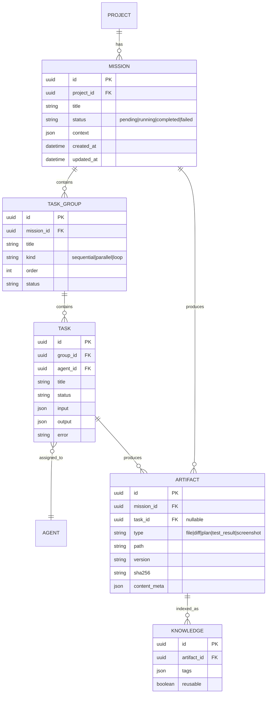

# MVP 詳細技術設計 (Phase 2: Mission/Workflow/UI)

**Status**: Draft
**Updated**: 2025-11-20
**Based on**: User Proposal (Step 335)

---

## 1. データモデル拡張 (Schema Design)

既存の `projects`, `agents`, `messages` に加え、タスク実行と成果物管理のための新テーブルを導入する。

### 1.1 ER図 (Conceptual)



### 1.2 テーブル定義詳細

#### `missions`
プロジェクト内の上位目標（ミッション）を管理。
- `status`: 状態遷移を管理。
- `context`: ミッション全体の共有コンテキスト（変数など）。
- `owner`: 作成者または責任者。
- `run_mode`: `sequential|parallel|loop` など実行モード。

#### `task_groups`
タスクの実行単位と制御構造。
- `kind`: 実行ロジックを指定 (`sequential`, `parallel`, `loop`)。
- `order`: 実行順序。

#### `tasks`
個々のアトミックな作業単位。
- `agent_id`: 担当エージェント。
- `input`/`output`: タスク間のデータ受け渡し用。

#### `artifacts`
生成された成果物のメタデータ。
- 実体は Blob Storage (Local/S3) または Git に保存。
- `type`: 成果物の種類 (`diff.patch`, `test_report.json` 等) で処理を分岐。
- `scope`: `session|user|project` の公開範囲。
- `version`: 同一タスク内での連番または semver/commit hash。
- `sha256`: 実体のハッシュ。
- `path`: `storage/artifacts/...` または S3 URI。
- `tags`: `["plan","diff","test","screenshot"]` など。

#### `knowledge`
再利用可能な知識。
- Artifact を検索可能にしたもの。
- `source_artifact_id`: 昇格元 Artifact を必ず保持。
- `summary`: 検索ヒント。LLM 用に 200 字程度を推奨。

---

## 2. WorkflowEngine v1 設計

### 2.1 アーキテクチャ

CLI からロジックを抽出し、再利用可能なクラスとして実装。

```python
class WorkflowEngine:
    def run(self, mission: Mission, context: Context) -> MissionResult:
        """ミッションのエントリーポイント"""
        pass

class SequentialWorkflow(WorkflowEngine):
    def run(self, mission, context):
        for group in mission.task_groups:
            self.execute_group(group, context)

class SelfHealWorkflow(SequentialWorkflow):
    def execute_group(self, group, context):
        try:
            super().execute_group(group, context)
        except TaskFailure as e:
            self.plan_recovery(e, context)
            # Re-run or skip
```

### 2.2 機能要件
- **Sequential Execution**: TaskGroup を順番に実行。
- **Context Propagation**: 前のタスクの `output` を次のタスクの `input` に渡す。
- **Self-Heal (Basic)**: テスト失敗 (`test_result` artifact with `status: fail`) を検知し、修正タスクを動的に挿入するフック。
- **Tracing**: `workflow_runs` (run_id, mission_id, mode, started_at, ended_at, status, trace_uri) に記録し、ci_evidence に `workflow_engine_*` イベントを残す。

---

## 3. UI アーキテクチャ (Manager/Graph/Inbox)

Next.js + React で実装し、`apps/orchestrator-ui` (multi-agent) の資産を流用・拡張する。

### 3.1 画面構成 (Three-Pane Layout)

1.  **Manager View (Main)**
    *   **Left**: Mission List (プロジェクト内のミッション一覧、ステータスフィルタ)。
    *   **Center**: TaskGroup Timeline (実行中のタスク、ログ、進捗)。
    *   **Right**: Artifact Cards (生成された成果物のプレビュー。Diff, Plan, Screenshot)。

2.  **Inbox View (Communication)**
    *   既存のメールUIを「Missionスレッド」として再構築。
    *   Systemログとエージェント間メッセージを時系列表示。
    *   Artifacts を添付ファイルとして表示。

3.  **Graph View (Future)**
    *   タスク依存関係とデータフローの可視化（Phase 3以降）。

### 3.2 共通コンポーネント (from multi-agent)
- **Language Toggle**: ヘッダ右配置。`page.tsx` の state 管理を流用。
- **Plan/Test Dashboard**: UI Gate/Audit と連動した簡易ダッシュボード。
- **Health Gate**: `/api/health/ui` エンドポイント。

---

## 4. API & Storage 設計

### 4.1 API エンドポイント (FastMCP + REST)

- Missions
  - `GET /missions?project_id=...` : 一覧＋status 集計
  - `POST /missions` : `{title, project_id, context, owner, run_mode}` → `{mission_id}`
  - `GET /missions/{id}` : Mission + TaskGroup/Task/Artifact/Knowledge を集約
  - `POST /workflow/run` : `{mission_id, entry_point?, mode, allow_self_heal}` → `run_id`
  - `GET /workflow/{run_id}/trace` : 実行トレース
- Tasks
  - `POST /tasks` : `{mission_id, task_group_id?, title, assignee, status, order, payload}` → `{task_id}`
  - `PATCH /tasks/{id}` : status/output/error/self-heal 結果を更新
- Artifacts
  - `POST /artifacts` : `{mission_id, task_id?, type, scope, content|file, tags}` → `{artifact_id, sha256, version}`
  - `GET /artifacts/{id}` : メタ＋ダウンロード URI
  - `POST /artifacts/{id}/promote` : Knowledge 昇格 → `{knowledge_id}`
- Knowledge
  - `GET /knowledge/{id}` : `{title, summary, source_artifact_id, tags}`
  - `POST /knowledge/search` : `{query, tags?}` → マッチ Knowledge + Artifact

### 4.2 Artifact Storage
- **Metadata**: SQLite (`artifacts`) に version/sha256/tags を保存。
- **Content**:
    - **Small (<1MB)**: DB `content_meta` または `blob` カラム。
    - **Large**: `storage/artifacts/` (ローカル) または S3。
    - **Versioned**: Git commit または version カラムで管理。

---

## 5. マイグレーション & 運用

### 5.1 移植戦略 (Clean Restart)
1.  **Phase 1 (Core)**: HTTP/DB基盤 + UI-Audit (完了)。
2.  **Phase 2 (Workflow/UI)**:
    - 新スキーマ (`missions` etc.) 導入。
    - WorkflowEngine v1 実装。
    - Manager UI (Next.js) 実装。
3.  **Phase 3 (Full)**:
    - Inbox 統合。
    - Graph View。
    - 既存 `multi-agent` 機能の完全移行。

### 5.2 Rules & Approvals
- `multi-agent` の `rules/` および `APPROVALS.md` の運用フローを適用。
- UI Gate: LCP/TTI/Axe 基準を厳格化。
- CI Evidence: `ci_evidence.jsonl` への記録を義務化。

---

## 6. テスト観点 (実装前に準備するチェックリスト)
- WorkflowEngine: Sequential 正常系／タスク失敗→self-heal 挿入／コンテキスト受け渡し。
- Artifacts/Knowledge: 生成→sha/version 保存、promote→Knowledge、search でタグ/クエリ一致。
- Manager UI (Playwright/RTL): Mission 一覧、TaskGroup タイムライン、Artifact タイル表示・リンク、self-heal 後ステータス更新。
- 回帰: 既存 Inbox/Dashboard が壊れないこと（lint/Jest/Playwright/pytest baseline）。
- Gate 前段: `auto_gate_decider` が `auto_gate_rules.yaml` に基づき UI Gate / SBOM / secret-scan / bandit / GitOps ゲートの run/skip を決定し、`ci_evidence.jsonl` に `event=auto_gate_decision`（component, decision, reason, base/head/pr など）を出力することを確認。

---

## 7. Council PoC (ChatGPT CLI / 正確性のみ)
- プロファイル: 生成=creative/concise/code、ジャッジ=fact_checker（正確性 0–10）、議長=chair。直列実行、timeout=60s、再試行なし。
- 匿名化: プロファイル名/自己紹介/挨拶除去、ですます統一、回答順シャッフル。
- スコアリング: 減点方式（10=完全正確、8–9=軽微、5–7=明確な誤り、1–4=重大誤り、0=無回答/ほぼ誤り）。3以下は不採用候補として議長に伝達。`Score: X/10` 形式を強制。
- エラーハンドリング: 個別失敗はスキップ記録、生成全滅で中断(status=failed)、fact_checker 全滅時は評価なしで議長が素回答から選択。
- ログ/証跡: `artifacts/council/<run_id>/` に question.txt（原文はここのみ）等を保存。`ci_evidence.jsonl` には `council_run` イベントを追加し、`question_hash`（生テキスト不可）、`run_id`, `timestamp`, `chosen_answer_id`, `scores:{accuracy}`, `scores_ext`, `profiles_used` を記録。
